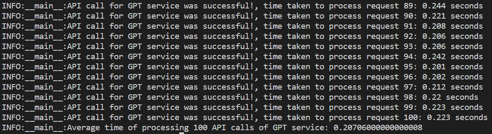
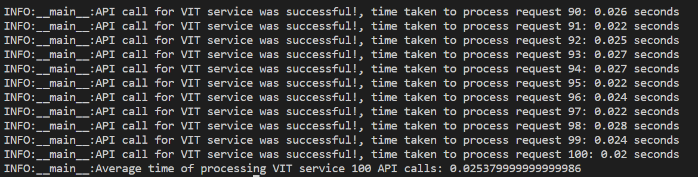

# EMLO-3_Assignment10
This is the 10th assignment of course EMLO from TSAI.

## Introduction
- Take the GPT Implementation Model
    - Scripted Model
    - Deploy it with FastAPI on Docker
- Take the VIT Implementation Model
    - Scripted Model
    - Deploy it with FastAPI on Docker
- Write pytest to test both model APIs
- 1 request at a time (basically no multiprocessing stuff, keep it simple)
- Test at least 100 API calls
- Average the response time for the 100 requests
- Log the response time for each
- Submit
    - Github Repository with above changes
    - Test results (avg response time)

## Getting started
Let's go through the steps to implement this repo.
- Folder `gpt_service/` contains code to build and test FASTAPI service for GPT model.
- Folder `vit_service/` contains code to build and test FASTAPI service for VIT model.
### Prepare docker image
Frist we have to prepare docker images which will host FASTAPI service for GPT and VIT.
 
We can do this in two ways, either build docker images from source or pull the same images from Dockerhub registry.

#### Build from source
We can use `make` command to quickly build images for the service. **Make sure to put trained model for GPT and VIT in respective directory** i.e. `gpt.torchscript.pt` and `vit.torchscript.pt`. Now lets follow the steps:
- Building service for GPT:
    - put scripted model `gpt.torchscript.pt` in /gpt_service dir.
    - run make command `make build-gpt` to build service image for gpt model.
- Building service for VIT:
    - put scripted model `vit.torchscript.pt` in /vit_service dir.
    - run make command `make build-vit` to build service for VIT model.
- You can build both of them single using make command `make build-images`

#### Pull from DockerHub
If you don't want to build image from source then you can pull docker images directly from the DockerHub. 
- To pull both images run following make command: `make pull-images`

### Run and test service
Now that we have build our service images, lets go through steps to run the services and test them using the python script with requests.
#### Run and test GPT service
Here also we will use make commands:
- Run `make run-gpt-service` to run the service on localhost:8080 and the api route `/gpt_inference`.
- To test the service run `make run-gpt-test`. This will run a python script which uses requests to make 100 API calls.

#### Run and test VIT service
- Run `make run-vit-service` to run VIT service on localhost:8080 and the api route is `/vit_inference`.
- To test the service run `make run-vit-test`. This will do the same 100 API calls using python and requests.

